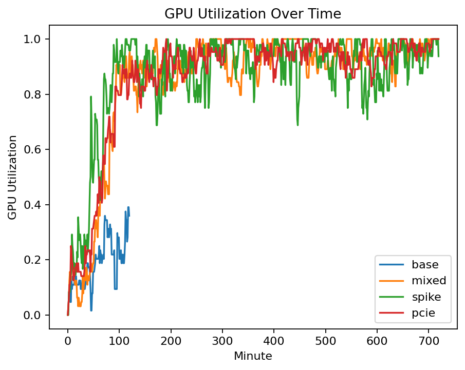
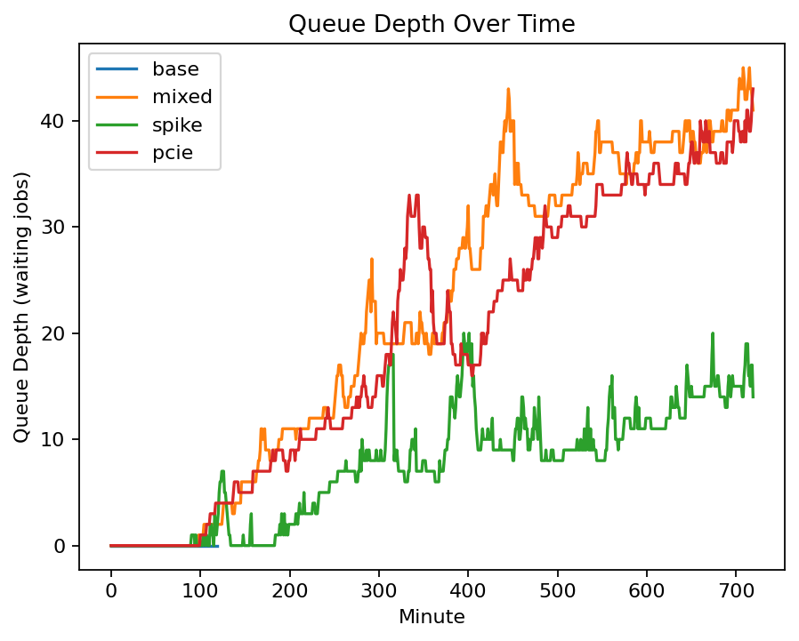

# GPU Cluster Capacity Simulator

A lightweight simulator for **GPU cluster capacity planning** for AI workloads.  
Models **utilization**, **queueing delay**, **packing / fragmentation**, and a simplified **cost view**.

This project is intentionally **infrastructure-focused**.  
It demonstrates how **AI compute systems behave under load**, rather than how to train or optimize ML models.

---

## What this simulator models

Given a cluster configuration and workload arrival patterns, the simulator estimates:

- **GPU utilization** over time
- **Queue depth and wait time** (including P50 / P95 indicators)
- **Inference SLA violations**
- **Cost efficiency** (GPU-hours with overhead)

This mirrors the real tradeoffs faced in **AI infrastructure, platform, and MLOps environments**.

---

## Architecture


**Execution flow**
1. Workload generator creates training and inference jobs
2. Scheduler assigns jobs to GPUs (capturing packing + fragmentation effects)
3. Simulator advances time and tracks system state
4. Metrics and reports are generated for analysis

---

## Quickstart

### 1) Install
```bash
python -m venv .venv
source .venv/bin/activate
python -m pip install -U pip
pip install -e ".[dev]"
````

### 2) Run a simulation

```bash
gpu-sim run --config configs/base.yaml \
  --out results/base_tick.csv \
  --out-jobs results/base_jobs.csv
```

**Outputs**

* `results/*_tick.csv` → utilization, queue depth, running/completed jobs
* `results/*_jobs.csv` → per-job wait time, assignment, SLA violations

---

## Scenarios Included

| Config                         | Purpose                                        |
| ------------------------------ | ---------------------------------------------- |
| `configs/base.yaml`            | Balanced training + inference baseline         |
| `configs/mixed_workloads.yaml` | Contention and fragmentation under mixed loads |
| `configs/inference_spike.yaml` | SLA pressure during inference bursts           |
| `configs/nvl_vs_pcie.yaml`     | Sensitivity to reduced interconnect efficiency |

Run all scenarios:

```bash
gpu-sim run --config configs/base.yaml --out results/base_tick.csv --out-jobs results/base_jobs.csv
gpu-sim run --config configs/mixed_workloads.yaml --out results/mixed_tick.csv --out-jobs results/mixed_jobs.csv
gpu-sim run --config configs/inference_spike.yaml --out results/spike_tick.csv --out-jobs results/spike_jobs.csv
gpu-sim run --config configs/nvl_vs_pcie.yaml --out results/pcie_tick.csv --out-jobs results/pcie_jobs.csv
```

---

## Results & Insights

### GPU Utilization



**Insight**

* High average utilization does **not** guarantee low latency
* Mixed workloads reduce effective throughput due to fragmentation

---

### Queue Depth & SLA Pressure



**Insight**

* Queue depth grows rapidly under bursty inference traffic
* SLA violations often appear **before** GPUs look fully saturated

---

## Streamlit Dashboard (Live, Interactive)

Run an interactive dashboard to compare scenarios and visualize utilization and queueing behavior.

```bash
pip install -r requirements.txt
streamlit run app.py
```

The dashboard supports:

* Scenario selection
* Live simulation execution
* KPI cards (utilization, P95 wait, SLA rate, cost)
* Time-series plots for utilization and queue depth

---

## Development & Quality

```bash
pytest -q
ruff check .
```

CI runs automatically via GitHub Actions.

---

## Why this project exists

AI infrastructure performance is rarely a pure “GPU count” problem.

This simulator highlights why real-world outcomes depend on:

* **Workload mix** (training vs inference)
* **Scheduling and packing**
* **Queueing dynamics**
* **SLA design**
* **Cost vs reliability tradeoffs**

These considerations are central to modern **AI platforms, cloud infrastructure, and MLOps systems**.

---

## Roadmap

* Pool partitioning (training vs inference)
* Priority scheduling and preemption
* Trace-driven workloads
* Multi-cluster comparisons
* More detailed cost models (power, networking)

---

## License

MIT

```

---
